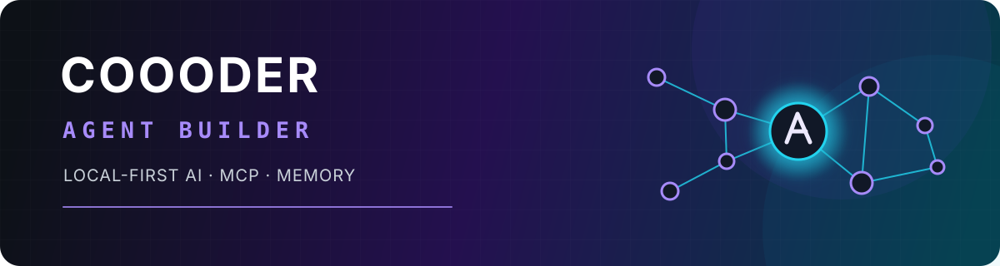

<p align="center">
  
</p>

<p align="center">
  <a href="https://git.io/typing-svg">
    
  </a>
</p>

<p align="center">
  
  
  
  
</p>

## Hey, I'm Coooder 👋

I'm an **Agent systems builder** working on local-first runtimes, MCP/A2A tooling, and auditable memory.

我在构建真正能长期生活在用户身边的 AI Agent：本地优先、可审计、可组合，并且尊重人的控制权。

I care less about making a model look impressive and more about making Agent systems reliable: structured memory, traceable state, composable tools, and automation that keeps people in control.

## Systems I'm building

| System | What I'm exploring |
| --- | --- |
| 🫀 **[Vital Agent Sync](https://github.com/Coooder-Crypto/vital-agent-sync)** | A local-first Apple Health connector that exposes user-controlled, scoped context to MCP-compatible Agents. |
| 🧠 **[MemTable](https://github.com/Coooder-Crypto/mem-table)** | A structured ledger for Agents: confirmed records, timestamps, schemas, aggregation, and source tracing — not another vector-memory wrapper. |
| 📚 **[Oh My Notion](https://github.com/Coooder-Crypto/oh-my-notion)** | A local-first Notion Agent with hybrid retrieval, skill routing, grounded answers, and inspectable memory. |

> **Memory recalls what happened. A ledger computes what changed.**

## Open-source contributions

| Project | Merged contribution |
| --- | --- |
| **[First Tree](https://github.com/agent-team-foundation/first-tree/pull/2140)** | Fixed session-operation queue cleanup while preserving per-session FIFO ordering across WebSocket close, with race-regression coverage. |
| **[AGNTCY Directory](https://github.com/agntcy/dir/pull/1962)** | Added a `CountRecords` gRPC API with distinct-record counting, generated bindings, and database/controller tests. |
| **[Atomic Agents](https://github.com/Eigenwise/atomic-agents/pull/272)** | Added project-instruction support for multiple AI coding assistants beyond a single vendor workflow. |

### Currently contributing

- **[A2A JavaScript SDK #178](https://github.com/a2aproject/a2a-js/issues/178)** — assigned to build public-API compatibility checks for breaking-change detection.
- **[OpenHands #15583](https://github.com/OpenHands/OpenHands/issues/15583)** — implemented slash-command parity across [`/help`](https://github.com/OpenHands/OpenHands/pull/16422), [`/condense`](https://github.com/OpenHands/OpenHands/pull/16423), [`/skills`](https://github.com/OpenHands/OpenHands/pull/16424), and [`/feedback`](https://github.com/OpenHands/OpenHands/pull/16425); all four PRs are review-ready.

## Agent principles

```text
local over opaque
inspectable over magical
composable over monolithic
consent-aware over always-on
useful over impressive
```

## Toolbox

<p>
  
  
  
  
  
  
  
  
</p>

## Find me

[Blog](https://coooder-blog.vercel.app/) · [X / Twitter](https://x.com/Coooder_Crypto) · [GitHub](https://github.com/Coooder-Crypto)

<p align="center"><sub>Building Agents that grow useful without growing beyond their users' control.</sub></p>
